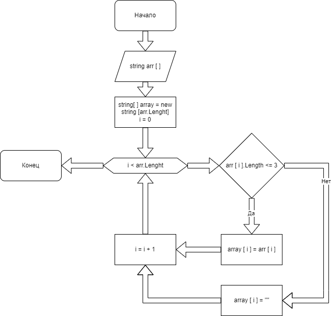

# Final_Task

_**Условие**_: Разработать программу, которая из имеющегося массива строк формирует массив из строк, длина которых меньше или равна 3 символов:
+ При решении не рекомендуется использовать коллекции

## 1. Получение данных
Данные генерируются посредством метода формирующего случайные строки. Длина строк задается случайным образом при помощи специального метода. Массив поэлементно заполняется строками ограниченной длины. Количество элементов массива так же случайно.

---

## 2. Обработка данных
При помощи специального метода создается новый массив по длине равный исходному, в него входят элементы, удовлетворяющие условиям.

---

## 3. Вывод данных

Для отображения результатов существует специальный метод, который при выводе на печать элементов массива оценимает длинну строки и в случае если она равна 0 не выводит данный элемент в консоль.

---

## 4. Демонстрация алгоритма

 
